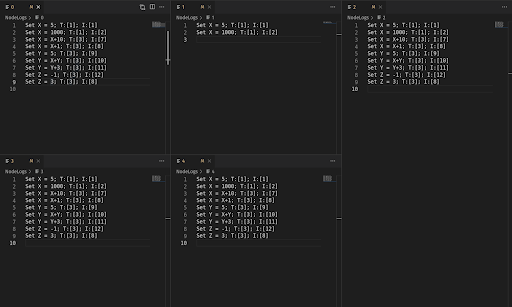

CLOUD COMPUTING - UE20CS351

# Project: Implementing Raft Logic in Go

## **In this project, you will:**

1. Learn the basics of GoLang.
2. Understand the basic logic behind Raft
3. Implement part of the logic behind raft, in GoLang, for leader election and log replication.

## **What you're given:**

You are provided with a GoLang project structure, which, when complete, will allow you to successfully demonstrate leader election and log replication via Raft. However, parts of the code are deliberately missing; Your job is to fill it in, and make sure that expected behaviour is observed in scenarios such as network partitioning.
```
.
├── go.mod
├── NodeLogs
│   ├── 0
│   ├── 1
│   ├── 2
│   ├── 3
│   └── 4
├── raft_cluster.go
├── raft_election_logic.go
├── raft_leader_logic.go
├── raft_node.go
├── raft_rpc_handlers.go
├── raft_test.go
├── README.md
├── server_setup.go
└── verbose
    ├── 1.log
    └── 2.log
```

The files server\_setup.go, raft\_node.go and raft\_cluster.go require no modification. raft\_node.go, however, contains vital information about the persistent state of a raft node itself, and is worth going through to better understand the flow of the code.

## **How you should start:**

Start off by installing GoLang. [Here](https://go.dev/doc/install) is a link to the official guide.

Once you've installed Go, it's a good idea to familiarise yourself with Raft. [The Raft Paper](http://raft.github.io/raft.pdf) itself, in conjunction with the interactive visualisation at [https://raft.github.io/](https://raft.github.io/), is a major help there.

You must also familiarise yourself with the basics of GoLang. [Here](https://go.dev/tour/) is a great guide to help you get started. Of course, you'll probably learn most by actually playing around with code.

Familiarise yourself with Raft Leader Election and Log Replication, i.e up until but not including Section 7 of the paper; you **do not** need to familiarise yourself with Log Compaction.

The scenarios we deal with here do not include complete node failure, although it is trivial to account for such a case by asking recovered nodes to replay their logs. Instead, we deal with **partitioned** nodes; i.e, a 'disconnected node' is a node that is still functioning, but is cut off from the rest of the cluster. Think along the lines of 'its internet failed.' **KNOWING THIS IS IMPORTANT FOR YOUR EVALUATION.**

## **What's expected of you:**

You are expected to implement **4** specific functionalities:

1. Implement the **becomeFollower** function entirely.
2. Implement the logic for a **follower** node to handle a received **RequestVote function** from a candidate.
3. Implement the logic for a **candidate** to handle a reply to the above RequestVote it sent out to its peers, be it successfully or unsuccessfully.
4. Implement the logic for the **leader** to commit its log successfully in the event of majority confirmation, or fail in case majority confirmation is not received.

These four functionalities' locations become apparent once you go through the codebase, and read through [the Raft paper.](http://raft.github.io/raft.pdf)

## **What you can use to test your code out:**

```ps
go test -v -race -run Test1 > verbose/1.log
```

```ps
go test -v -race -run Test2 > verbose/2.log
```

The above command executes a couple of scenarios for your code. Read through the logs generated in the verbose directory for **Test1** , and make sure to have all 5 files open in NodeLogs and watch them update in real time for **Test2** (like this:)

<p align="center">
  
</p>

You could also instead tail -f the files with tmux, like you did for Experiment 4.

For evaluation, you will need to walk through the output you got from the Tests 1 and 2 and explain why it's expected behaviour. You will also need to then execute test-cases given to you later and do the same. **(Test 3 given to you will fail by default; it's your job to explain why and how to fix it.) (refer to the last paragraph of 'how you should start')**


## **For queries, contact:**

**RR Campus:** [**tacloudcomputing@gmail.com**](mailto:tacloudcomputing@gmail.com)